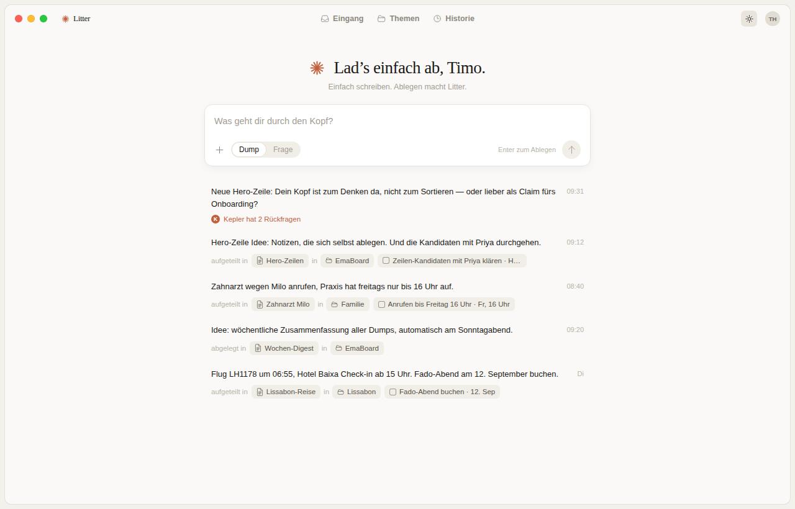

# Litter

Brain-dump notes that file themselves. A local-first macOS app: you dump raw thoughts, and **Kepler** — an agent built on the Claude Agent SDK — splits them into documents, sorts them into themes, detects todos, and answers questions from your own notes with quote-anchored citations. Everything lives in a local SQLite database; there is no online backend.

Built from the design **“Dump v10 Ohne Sidebar”** (Claude Design).



## How it works

- **Dump** — type a raw thought, hit Enter. The dump is stored verbatim and is *immutable*: the agent never edits it. Kepler reads it, splits mixed dumps into parts, appends to existing documents or creates new ones, files each document under exactly one theme (creating themes with its own filing rules as descriptions), and turns action items into todos.
- **Rückfragen** — when Kepler is genuinely unsure it asks up to two short questions with option chips, then shows a filing proposal (Titel / Thema / Todo) that you confirm with *„Passt, ablegen“*. Confident filings happen silently; you can re-file from the feed at any time.
- **Frage** — switch the capture field to *Frage* and ask your notes. Kepler searches (SQLite FTS5), reads documents, and answers only from your notes. Every claim carries a citation `[source: note:ID "verbatim quote"]`; the app anchors the quote in the real document and shows *„Belegt durch“* chips — clicking one opens the document with the quoted passage highlighted. Citations that don't anchor are dropped, so hallucinated sources can't appear.
- **Historie** — every dump's conversation is persisted; reopen it any time and continue chatting (sessions resume via the Agent SDK's session ids).

## Stack

| Layer | Choice |
|---|---|
| Shell | Electron + electron-vite, React 18, TypeScript |
| Database | better-sqlite3 (WAL), FTS5 full-text index, local file in `~/Library/Application Support/Litter/` |
| AI | `@anthropic-ai/claude-agent-sdk` in the main process — uses your **Claude subscription login**, no API key |
| Agent tools | In-process MCP server (`list_themes`, `create_document`, `append_to_document`, `create_todo`, `search_notes`, `ask_user`, `propose_filing`, …) |

The agent gets **no built-in tools** (`tools: []`) — it can only act through the app's own MCP tools, so it can never touch anything outside the app's data. Inside Electron the SDK runtime is spawned with Electron's own binary (`ELECTRON_RUN_AS_NODE`), so no system Node is required.

### Database schema (SQLite)

- `dumps` — raw brain dumps, verbatim, never edited (`status`: pending → processing → processed/failed)
- `themes` — created and maintained by the agent; `description` is the agent's own filing rule
- `notes` — documents: one dump → many notes, each note in exactly one theme; content is simple markdown
- `todos` — detected tasks with free-form due labels
- `agent_sessions` / `agent_messages` — full conversation history per dump/question, incl. SDK session id for resume
- `notes_fts` — FTS5 index over titles + content, kept in sync by triggers

## Development

```bash
npm install          # also rebuilds better-sqlite3 for Electron
npm run dev          # dev app (rebuilds native deps for Electron first)
npm test             # unit tests (rebuilds better-sqlite3 for Node first)
npm run typecheck
npm run dist:mac     # build .dmg / .zip into dist/
```

`npm test` and `npm run dev` need different native ABIs for better-sqlite3; the pre-scripts switch automatically.

### Claude login

The app uses the Claude Code credentials on your Mac. Log in once in a terminal:

```bash
claude   # then /login with your Claude subscription
```

`CLAUDE_CODE_OAUTH_TOKEN` (from `claude setup-token`) or `ANTHROPIC_API_KEY` also work.

### Demo mode without login

```bash
LITTER_FAKE_AGENT=1 npm run dev
```

runs a scripted stand-in agent (filing, Rückfragen, proposals, cited answers) — used by the E2E tests, handy for UI work.

Other env vars: `LITTER_DB_PATH` (custom database location), `LITTER_DEBUG=1` (agent stderr logging).
